```{r setup, include = FALSE}
knitr::opts_chunk$set(
  collapse = TRUE,
  comment = "#>"
)

data_frame <- function(...) {
  data.frame(stringsAsFactors = FALSE, ...)
}
```

## Stochastics

VIMC modelling groups produce stochastic data for us, which is currently 200
runs of their models varying key parameters, to express uncertainty. These files
get uploaded to Box, and the groups are provided with guidance to produce files
that we can process easily.

Stoner can process these stochastic files into a standard format to make the
files more predictable to work with. For a good compromise between ease-of-use,
performance and compression, we have used the `Parquet` format and the `arrow`
package. This vignette covers how to process the data, how to create a central
from a set of stochastics, how to produce some graphs of the stochastics for
quick diagnosis, and also how to use the stochastic explorer, a local shiny app
for exploring and comparing stochastic datasets.

### Creating standard stochastic files

This has superseded `stoner_stochastic_process`, which will be removed and
undocumented soon.

Here, we are mostly likely working with two folders or network shares, one of
which contains the stochastics that groups have uploaded, and the other is a
destination where we want to write our standardised files. These I'll call
`in_path` and `out_path`. The `out_path` folders I am assuming will be only
written to by stoner; paths and filenames will adhere to the following format:-

-   Within the root of the share we will have the **touchstone**, without a
    version. At time of writing, we have `202310gavi` and `202409malaria`. I am
    not anticipating having separate stochastics for separate versions of the
    stochastics at this point.

-   Within those touchstone folders, we have more folders in the form
    `Disease_Modelling-Group` - such as `COVID_IC-Ghani` or `YF_IC-Garske`. The
    groups and diseases set up here copy the historic contents of the Montagu
    database.

-   Within each of these folders, we will be writing a file per country per
    scenario, containing all run_ids, named in the format
    `Modelling-Group_scenario_country.pq` - for example,
    `IC-Garske_yf-routine-ia2030_KEN.pq`. If we also create a average (central)
    of the stochastics (see later), that will be called
    `IC-Garske_yf-routine-ia2030_central.pq`, containing all the countries, and
    no run_id.

-   Finally, in the root of the standardised folder, we'll keep a file
    `meta.csv` to describe in one file the range of stochastic data we have by
    touchstone, disease, group and scenario, and for each the outcomes and
    countries provided. This is useful for speeding up the stochastic explorer
    shiny app, but also may be a useful quick reference of our inventory in
    general.

#### Example Usage - One file per scenario

Examples used so far are in the `scripts` folder in the root of the stoner
repo - files such as `process_stoch_202310gavi.R`. Here is an example of the
Yellow Fever standardisation:-

```         
scenarios = c("yf-no-vaccination", "yf-routine-bluesky",
              "yf-routine-campaign-bluesky", "yf-routine-campaign-default",
              "yf-routine-campaign-ia2030", "yf-routine-default",
              "yf-routine-ia2030")

stoner::stone_stochastic_standardise(
  group = "IC-Garske",
  in_path = file.path(base_in_path, "YF-IC-Garske"),
  out_path = file.path(base_out_path, "YF_IC-Garske"),
  scenarios = scenarios,
  files = "burden_results_stochastic_202310gavi-3_:scenario Keith Fraser.csv.xz")
```

`base_in_path` and `base_out_path` are defined elsewhere, and are my drive
mappings to the incoming, and destination network shares. We'll briefly talk
about those later.

We provide the group name, the paths to the uploaded files and the destination
we want to write files to. Note that the `in_path` is not managed, and might be
arbitrary - here it has dashes instead of underscores; but the `out_path`, we
need to be careful to get right, in the format `disease` then underscore then
the modelling group.

We then provide the vector of scenarios, and because this group follow the
guidance very well, they have included the exact scenario in the filenames. We
can therefore use the `:scenario` glob in the `files` argument, and stoner will
handle each of the seven scenarios in the right order.

#### Example Usage - One file per run

Other groups provide a file per run, which is also fine. Here, we can specify an
additional `index` parameter, usually `1:200`, and use the glob `:index` in the
files argument. Here is an example of that - but note for this group, they
didn't *quite* include the scenarios exactly in the filenames, so we have to
explicitly name the files, rather than using the `:scenario` glob. This is still
yellow fever, so using the same `scenarios` vector as before.

```         
stoner::stone_stochastic_standardise(
  group = "UND-Perkins",
  in_path = file.path(base_in_path, "YF-UND-Perkins"),
  out_path = file.path(base_out_path, "YF_UND-Perkins"),
  scenarios = scenarios,
  files = c("stochastic_burden_est_YF_UND-Perkins_yf-no_vaccination_:index.csv.xz",
            "stochastic_burden_est_YF_UND-Perkins_yf-routine_bluesky_:index.csv.xz",
            "stochastic_burden_est_YF_UND-Perkins_yf-routine_campaign_bluesky_:index.csv.xz",
            "stochastic_burden_est_YF_UND-Perkins_yf-routine_campaign_default_:index.csv.xz",
            "stochastic_burden_est_YF_UND-Perkins_yf-routine_campaign_ia2030_:index.csv.xz",
            "stochastic_burden_est_YF_UND-Perkins_yf-routine_default_:index.csv.xz",
            "stochastic_burden_est_YF_UND-Perkins_yf-routine_ia2030_:index.csv.xz"),
  index = 1:200)
```

The subtle difference is that the group used underscores instead of dashes in
the scenario names. So here, I have to be careful and ensure the order of
`files` matches the order of `scenarios` manually. After that, the `:index`
glob, and the `index` argument deal with the fact we have 200 files per
scenario.

#### Example Usage - One file per country

If groups want to supply a file per country, then at present, we need them to do
so including the country in their uploads as normal, but number their files
using the `index` method above, rather than having country names or ISO codes in
the filename. We could do better if this proves to be a popular method.

### Updating the meta-data

Having run `stone_stochastic_standardise` and made changes to the structure, to
enable the stochastic explorer shiny app to use the data (and to keep a useful
file up-to-date), we need to run a command to update the metadata.

```         
stoner::stone_stochastic_make_meta(out_path)
```

which will run for a few seconds, recreating the entire file. The columns are
touchstone, disease, group, scenario, countries and outcomes; the first four
will be single elements, whereas countries and outcomes will be semi-colon
separated lists.

### Advanced Usage

You shouldn't have to worry about these things, but this is just so that you
know they are there. We have some historic fixes that have made it possible for
us to process some groups' stochastics with some formatting issues, rather than
asking them to resubmit. These fixes are enabled by default; they won't do
anything bad for groups where the fixes are not relevant, and are strictly
required for the groups where they are relevant.

#### The Rubella Fix

An argument `rubella_fix`, by default `TRUE`, deals with the fact that rubella
groups have traditionally uploaded with different outcome names. Instead of
`deaths`, `rubella_deaths_congenital`, and instead of `cases`,
`rubella_cases_congenital`. Some groups additionally supplied the
`rubella_infections` outcome.

The `rubella_fix` argument causes stoner to omit `rubella_infections`, and
rename the others to `deaths` and `cases` respectively, standardising them
against the other diseases.

#### The Missing Run Id fix

One group also is in the habit of sending us one file per run_id, but omitting
the `run_id` field from their uploads. The argument `missing_run_id_fix`,
default `TRUE` lets Stoner spot this, and specifically if `index` is `1:200`
(ie, we are expecting 200 uploads), it will transplant the index into the file
to allow processing to be done normally.

### Other Considerations:

-   Stoner rounds of all the outcomes, (deaths, cases, dalys, yll and
    cohort_size) to be integer-like, which can create some confusion with small
    countries with a very small number of cases, but we expect those confusions.
    Some groups still provide us with 16 decimal places, which creates some
    problems, and the integer-like rounding is in the guidance.

-   Note that for some groups with very large files (especially those with 16
    decimal places), the processing takes **a lot of memory** - towards 128Gb.
    So run these on a large machine or perhaps a cluster node.

### More about the paths

If at all possible, you should perform Stoner tasks on a computer within DIDE,
connected with a cable. Stochastic processing involves large volumes of data,
and ZScaler from outside, or even WiFi from inside may not copy that well with
these tasks.

On a DIDE Windows machine, `in_path` and `out_path` can be fully-qualified paths
to DIDE network shares, which only members of the VIMC team have access to. This
is probably the easiest case.

On Linux or Mac, you have to mount the DIDE network shares, providing your DIDE
details, and it is up to you what you call your local mountpoints. On linux,
they may start with `/mnt/` and on Mac `/Volume/`. Talk to IT, if you need help
setting up those mounts.

And lastly, if you're on a windows machine but for some reason need to work
externally, then use ZScaler, map drive letters to the network shares, and pass
those in, but as we said, this is not recommended as it's not particularly
stable. If at all possible, use an internal machine to do the heavy data work,
and remote desktop into that if you need to be external.

## Creating a central estimate

For many groups, their central estimates are the average of their stochastic
runs. Historically groups have provided their centrals before their stochastics,
as a means of early review and detection of problems. Having standardised a
group's stochastic files, we can then generate an averaged central for a single
touchstone, disease, group and scenario, with the following call:-

```         
stone_stochastic_central(base, "202310gavi", "YF", "IC-Garske", 
                         "yf-routine-campaign-ia2030")
```

`base` here is the root of the share where our standardised stochastic outputs
have been put, and since those were created by stoner, it knows how to build the
paths correctly.

The result will be a new file in the form `group_scenario_central.pq` so in this
case `IC-Garske_yf-routine-campaign-ia2030_central.pq` which matches the other
standardised filenames, except for the country; this one central file will
contain all countries.

The default averaging function is `mean` - if we really want the `median` of the
stochastics, then add the argument `avg_method = mean` to the function call.
Note the lack of quotes - we are sending a function, not the name of a function.

## Creating stochastic graphs

The `stone_stochastuc_graph` function can dig out a range of different graphs.
If you want to explore the stochastics interactively, then try the shiny app
(below) - but for programmatic plotting, read on.

### Basic burdens.

With `base` set to the root of the share where we are putting our standardised
outputs, here is an example function call, and the graph that it produces.

```         
stone_stochastic_graph(base, "202310gavi", "YF", "IC-Garske",
                       "KEN", "yf-no-vaccination",
                       "deaths")
```

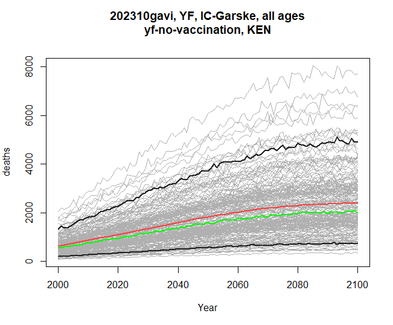

The grey lines are each and every stochastic run. Red is the mean, and green is
the median of the stochastics. The thicker black lines are the 5% and 95%
quantiles. We can toggle the presence of each of those line types with the
optional arguments `include_stochastics`, `include_quantiles`, `include_mean`
and `include_median`, which can be set to `FALSE`, or left as the default
`TRUE`.

### Burden Differences

If we specify two scenarios instead of one, then the plot will be the burden of
the first scenario, subtract the burden of the second - i.e., the difference
made by applying a scenario. Below is an example - I'll also add the
`log = TRUE` argument to get a logged y-axis.

```         
stone_stochastic_graph(base, "202310gavi", "YF", "IC-Garske",
                       "KEN", c("yf-no-vaccination", "yf-routine-campaign-ia2030"),
                       "deaths", log = TRUE)
```

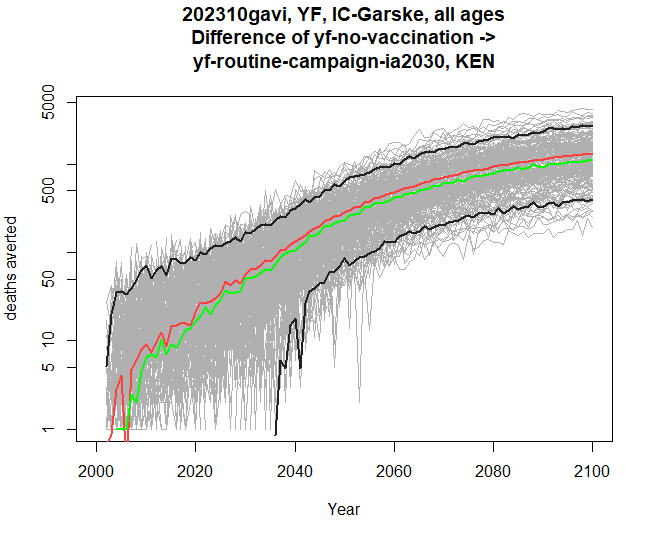

The y-axis now reads "deaths averted" instead of just deaths.

### Comparing touchstones

You may have noticed that `stone_stochastic_graph` when you run it causes a plot
to appear, but is actually returning you a list of plots - one so far. If we
specify two touchstones, then stoner will instead return us a list of two
graphs - assuming that the same disease, group and scenarios are present in both
touchstones. The y-axis will be matched between the two, so we can see the pair
of graphs for comparison.

Below is an example returning to just a single scenario, although you can
provide two and compare burden differences across two touchstones too. Here I am
collecting both resulting graphs, and then plotting them one by one.

```         
res <- stone_stochastic_graph(base, c("202110gavi", "202310gavi"), "YF", "IC-Garske",
                       "ETH", "yf-no-vaccination",
                       "deaths", log = TRUE)
res[[1]]
res[[2]]
```

::: {style="display: flex; gap: 10px;"}
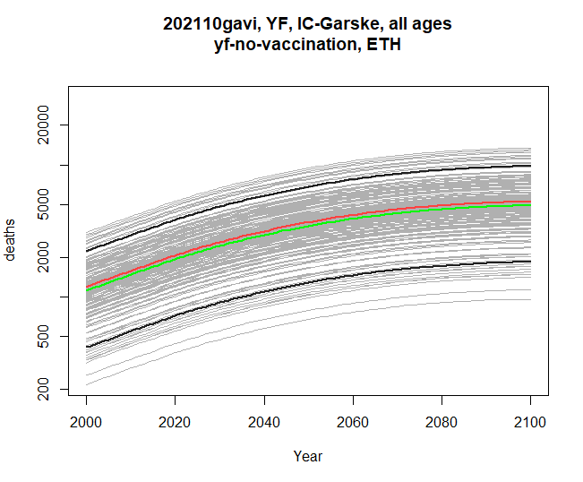
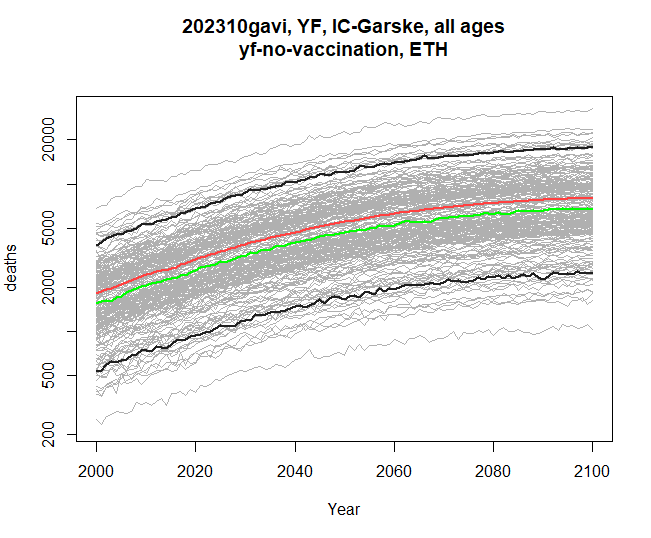
:::

### Comparing modelling groups

Similarly, within the same touchstone, we can compare two modelling groups, with
either a single scenario, or pair of scenarios. The disease, scenarios and
outcomes must be compatible between the two groups. Here's a comparison of
burden difference:

```         
res <- stone_stochastic_graph(base, "202310gavi", "YF", 
                              c("IC-Garske", "UND-Perkins"),
                              "UGA", 
                              c("yf-no-vaccination", "yf-routine-default"),
                              "cases")
res[[1]]
res[[2]]
```

::: {style="display: flex; gap: 10px;"}
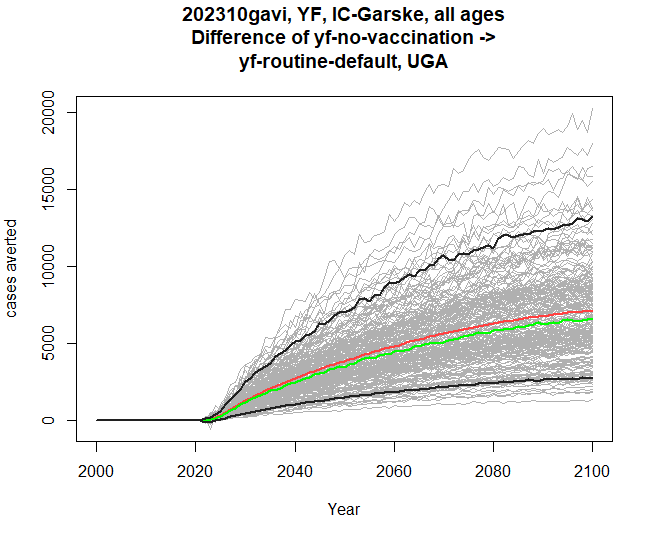
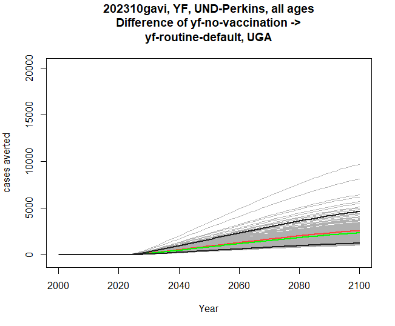
:::

### Filtering by age

The stochastic data contains both years and ages. Our plots so far have been
using time on the x-axis, and all the ages have been summed together for each
calendar year. We can also filter by age before plotting. The example below
filters to ages between 0 and 4 inclusive (ie, under 5 year-olds).

```         
res <- stone_stochastic_graph(base, "202310gavi", "YF", "IC-Garske", "UGA",
"yf-no-vaccination", "deaths", filter = 0:4)
```

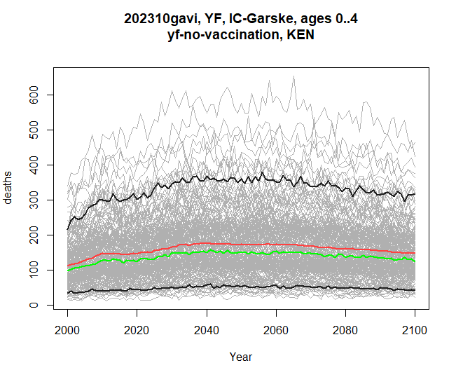

### Plotting by birth cohort

The `by_cohort` parameter lets us subtract age from year before plotting, so we
can see burden specific to people who were born in a certain year, rather than
the previous plots, which have all treated the x-axis as calendar year.

```         
res <- stone_stochastic_graph(base, "202310gavi", "YF", "IC-Garske", "UGA",
                              "yf-no-vaccination", "deaths", by_cohort = TRUE)
```

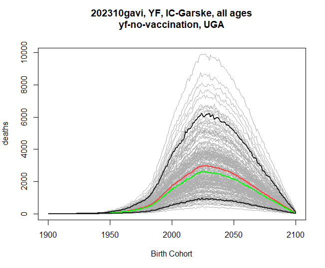

### Age on the x-axis

If instead we want to see how burden affects people of different ages throughout
the time series, we can set `xaxis` to `age` (its default is `time`).

```         
res <- stone_stochastic_graph(base, "202602yf", "YF", "IC-Gaythorpe", "UGA",
                              "yf-no-vaccination", "deaths", xaxis = "age")
```

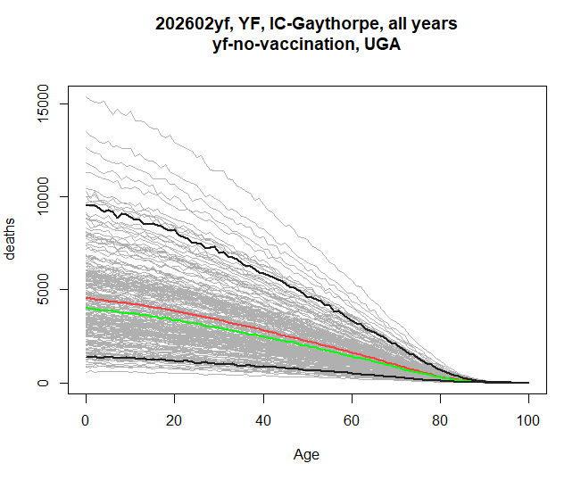

This sums over the entire range of years. If `xaxis` is age, then the `filter`
argument will let you select which years are to be included. This example shows
the burden by age in the years 2040-2050.

```         
res <- stone_stochastic_graph(base, "202602yf", "YF", "IC-Gaythorpe", "UGA",
                              "yf-no-vaccination", "deaths", xaxis = "age",
                              filter = 2040:2050)
```

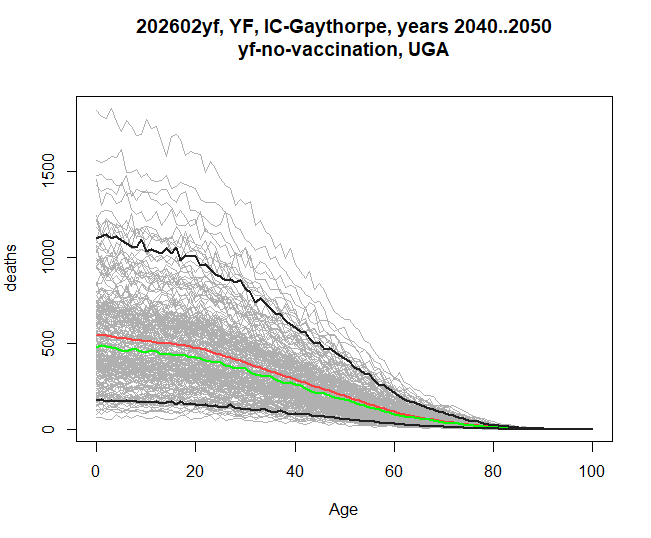

And if we additionally set the `by_cohort` flag, then we are asking for the
burden breakdown by age, for people who were born within the filtered range,
rather than selecting a calendar year range.

```         
res <- stone_stochastic_graph(base, "202602yf", "YF", "IC-Gaythorpe", "UGA",
                              "yf-no-vaccination", "deaths", xaxis = "age",
                              filter = 2040:2050, by_cohort = TRUE)
```

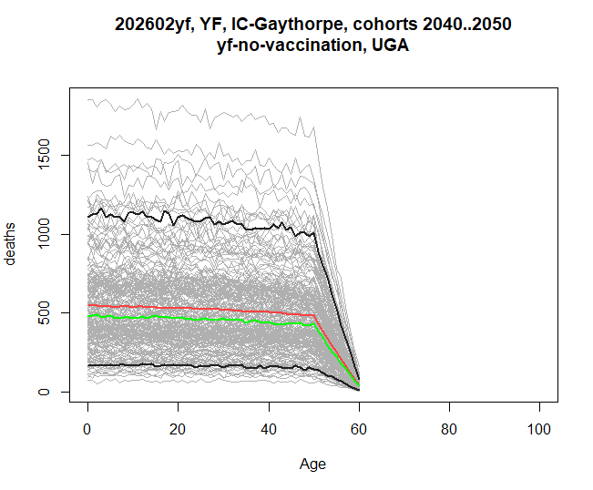 The graph has this shape because the
stochastics here only continue until 2100, hence the last 60-year olds will be
born in 2040.

### Including data from packit.

Lastly, if a central burden estimate has been included in a packit in Montagu's
reporting portal, we can include that on a graph by specifying the id, and the
name of the file within that packit. For example, this graph shows both the
stochastics from the file share, and the central from a packit, which is drawn
in blue.

```         
res <- stone_stochastic_graph(base, "202602yf", "YF", "IC-Gaythorpe", "UGA",
                              "yf-no-vaccination", "deaths", 
                              packit_id = "20260421-090519-e4a90228",
                              packit_file = "burden-estimates-disaggregated.rds")

Visit <https://montagu.vaccineimpact.org/packit/device> and enter code DNLH-NMRL

✔ Waiting for response from server [10.6s]
```

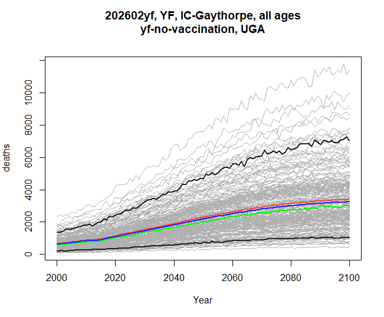

And here's an example of a burden difference graph, showing how much difference
the `yf-routine-default` scenario makes in both the stochastics, and the central
from packit.

```         
res <- stone_stochastic_graph(base, "202602yf", "YF", "IC-Gaythorpe", "UGA",
                               c("yf-no-vaccination", "yf-routine-default"), "deaths", 
                               packit_id = "20260421-090519-e4a90228",
                               packit_file = "burden-estimates-disaggregated.rds")

Visit <https://montagu.vaccineimpact.org/packit/device> and enter code MBWV-NBBC
✔ Waiting for response from server [10.9s]
```

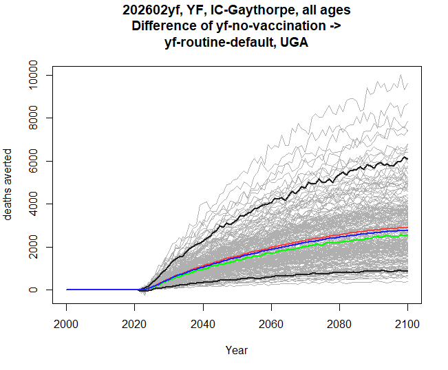 \## The stochastic explorer shiny app

All of the graphs above (except currently the packit graphs) can be visualised
interactively using a shiny app that is part of stoner. We call it providing the
path to the root of the standardised stochastic data, where the `meta.csv` file
should also be found.

```         
stoner::stochastic_explorer(path)
```

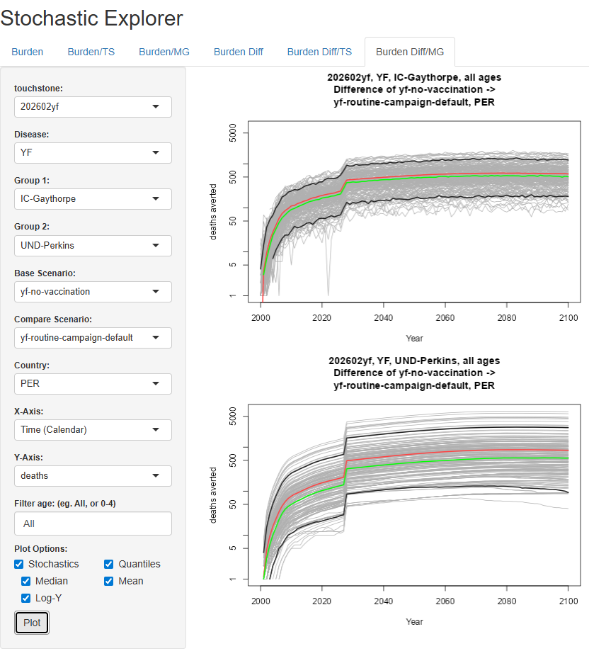

The features in the GUI closely map onto the parameters for `stochastic_graph`
in the following ways:

-   The tabs along the top let you choose a single graph, a comparison by
    touchstone, or a comparison by modelling group, firstly for simply burdens,
    and secondly for differences between scenarios. Different tabs therefore
    cause different components in the sidebar to be available.
-   One or two touchstones, groups, or scenarios will be available depending on
    the tab.
-   Whether the x-axis is time or age, and whether by cohort, are all selected
    in the x-axis dropdown.
-   The filter text, whether for time or for age, is a comma-separated list of
    numbers or dash-separated ranges. So in a contrived example, `0-5,50,95-100`
    would select the very young, very old, and exactly 50-year olds.
